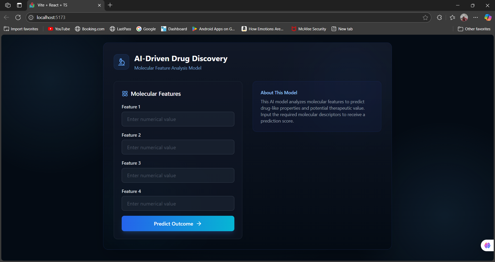
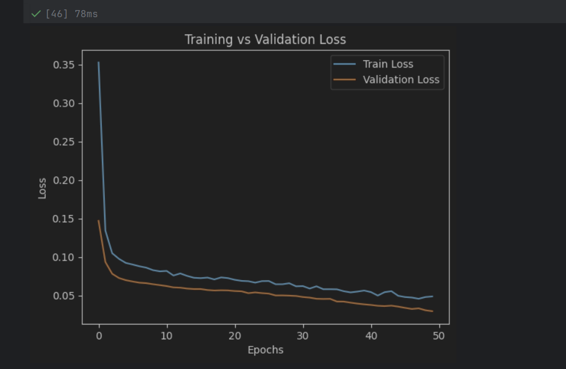
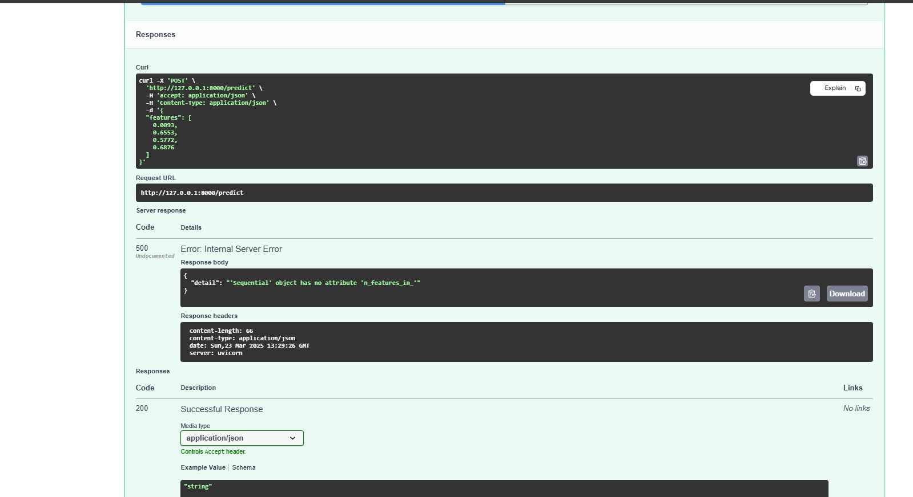
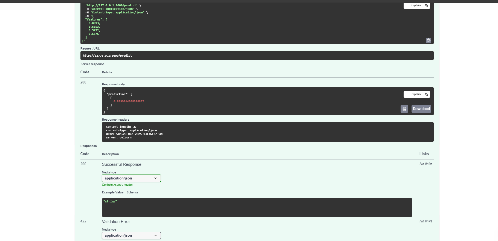
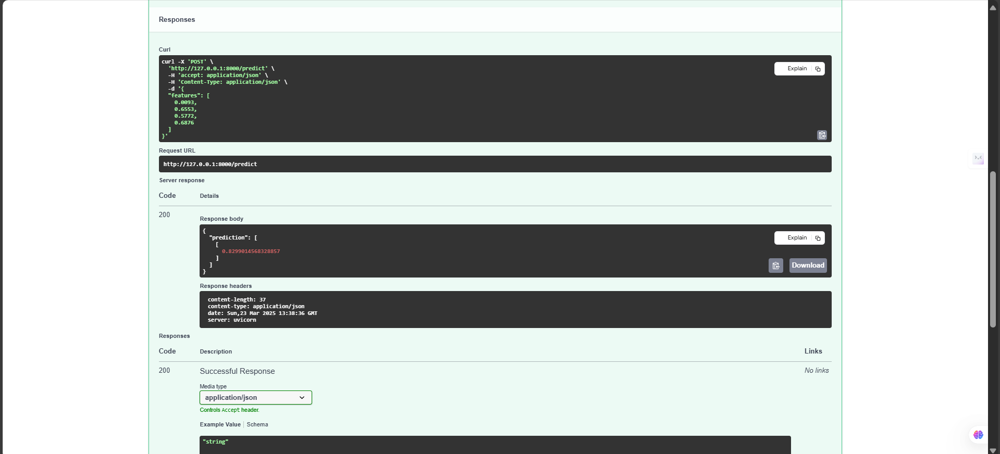

# 🚀 Drug Discovery with Machine Learning and FastAPI

Welcome to the **Drug Discovery Acceleration Project**!  
This repository demonstrates the use of a trained **Multi-Layer Perceptron (MLP)** model for predicting molecular properties, deployed through a **FastAPI** server for real-time access.

---

## 🧠 Project Overview

Traditional drug discovery processes are time-consuming and expensive.  
This project aims to **accelerate** early-stage drug discovery by using a machine learning model trained on molecular features to predict bioactivity — enabling faster screening of potential drug candidates.

The project includes:
- A trained **MLP neural network** model built using **TensorFlow/Keras**.
- A **FastAPI** application to serve the model and expose endpoints for real-time predictions.

---

## 🏗️ Project Structure

```
├── main.py          # FastAPI application with endpoints
├── trial2.keras     # Pre-trained MLP model
├── README.md        # Project documentation
└── requirements.txt # Dependencies
```

---

## 🔥 How to Run the Project

1. **Clone the repository:**
   ```
   git clone https://github.com/nidhi752/4th-semester-ai-project.git
   
   ```

2. **Install required packages:**
   ```
   pip install -r requirements.txt
   ```

3. **Start the FastAPI server:**
   ```
   uvicorn main:app --reload
   ```

4. **Access in browser:**
   - Home page: [http://127.0.0.1:8000/](http://127.0.0.1:8000/)

---

## 🌟 API Endpoints

- `GET /`
  - Checks if the server is running.
  - Example response:
    ```json
    {
      "message": "MLP Drug Discovery API is running!"
    }
    ```

- `POST /predict`
  - Input: JSON object containing molecular feature values.
  - Example input:
    ```json
    {
      "features": [0.0093, 0.6553, 0.5772, 0.6876]
    }
    ```
  - Example output:
    ```json
    {
      "prediction": 0.7482
    }
    ```

---

## 📸 Preview

| Home Page | Prediction Example |
|:---------:|:------------------:|
|  |  |
|  |  |
|  |  |
|  |  |

*(Make sure the images are in the same folder as your `README.md` or adjust the paths accordingly.)*

---

## 🧩 Tech Stack

- **Python 3.11+**
- **TensorFlow / Keras** — Neural network modeling
- **FastAPI** — Web server framework
- **Uvicorn** — ASGI server
- **Pydantic** — Request validation
- **NumPy** — Data handling

---

## 🚀 Future Enhancements

- Deploy on AWS / Azure / GCP for real-world testing.
- Integrate authentication for secure API access.
- Expand to handle multi-class or multi-label classification problems.
- Log and store predictions in a database for future analytics.

---

## 🙌 Acknowledgements

- [TensorFlow Documentation](https://www.tensorflow.org/)
- [FastAPI Documentation](https://fastapi.tiangolo.com/)
- Inspired by cutting-edge AI research in drug discovery (Nature, IEEE, Science).

---

## 📜 License

This project is licensed for educational use only.  
© 2025 Nidhi Kuntal

---

# ✨ Thank you for exploring this project!

